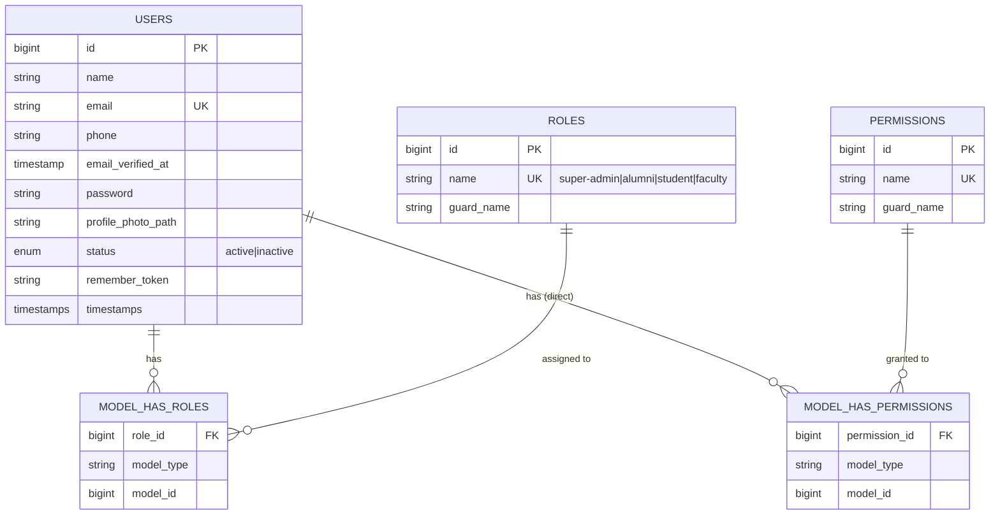

# Design

Everything about *what* the system is and *how* it's architected. For *when* things get built, see `PLAN.md`. Nothing here should be treated as "already built" — check `PLAN.md`'s progress log for actual status.

---

## 1. Stack

| Concern | Choice |
|---|---|
| Backend | Laravel 12, PHP 8.4+ |
| Frontend | Blade + Tailwind CSS + Alpine.js, responsive |
| Database | MySQL |
| Auth | Laravel Breeze |
| Authorization | Spatie Laravel Permission |
| File upload | Laravel Storage |
| PDF | barryvdh/laravel-dompdf |
| Excel | Laravel Excel (maatwebsite/excel) |
| Charts | Chart.js |
| Icons | Heroicons |

## 2. Roles (RBAC)

`super-admin`, `alumni`, `student`, `faculty` — each with a separate dashboard, nav menu, and permission set. Canonical list: `App\Enums\RoleName`.

## 3. Auth requirements

Login, registration, forgot/reset password, email verification, change password, profile photo, update profile, remember me. All present via Breeze + `App\Models\User implements MustVerifyEmail`.

## 4. Alumni verification workflow

```
Registration → Upload proof (graduation cert / student ID / certificate)
  → Pending → Admin reviews uploaded docs → Approved | Rejected → Verified Alumni
```

Status enum: `pending`, `approved`, `rejected`. New alumni are **not** active/visible in the directory until approved.

## 5. Modules

1. **User Management** — admin CRUD on users, assign roles, activate/deactivate, search/filter/paginate.
2. **Alumni Profile** — personal (name, email, phone, gender, DOB), academic (student ID, department, program, batch, session, graduation year, CGPA optional), professional (company, designation, industry, years experience, country, district, office address), social links (LinkedIn, GitHub, Facebook, portfolio), plus skills, biography, interests, profile photo.
3. **Alumni Directory** — public-facing search (name, student ID, department, batch, session, graduation year, company, country, district, skills), sort (latest joined, name, graduation year). Only verified alumni appear.
4. **Events** — admin/faculty create/edit/delete/publish/archive; fields: title, banner, description, venue, date, time, capacity, registration deadline. Users register/cancel/view registered events. Admin views participants, exports list, marks attendance.
5. **Job Portal** — verified alumni post jobs (company, logo, position, category, employment type, salary, experience, location, deadline, description, apply URL). Workflow: created → pending approval → admin approves → published. Students browse/search/bookmark.
6. **Mentorship** — student selects alumni mentor → sends request → mentor accepts → meeting scheduled → completed. Status: pending, accepted, rejected, completed.
7. **Notice Board** — admin/faculty publish notice/circular/scholarship/news/announcement. Users search, download attachment, bookmark.
8. **Success Stories** — verified alumni submit (title, story, images, company, achievement) → admin approval → published.
9. **Donation Management** — campaigns; users donate, view history, download receipt; admin views reports/campaign stats/donation reports.
10. **Gallery** — albums (reunion, convocation, seminar, workshop, cultural program); image preview + lazy loading.
11. **Documents** — repository with categories (newsletter, annual report, magazine, forms); secure download.
12. **Feedback** — users submit suggestions/complaints/feature requests; admin replies, closes ticket, exports reports.

## 6. Dashboards (per role)

- **Admin**: cards — total alumni, verified alumni, students, faculty, events, jobs, donations, pending verification. Charts — alumni by department, alumni by batch, alumni by country, event participation, monthly donations.
- **Alumni**: cards — profile completion, upcoming events, posted jobs, mentorship requests, donation history.
- **Student**: cards — saved jobs, applied mentorship, upcoming events, notices.
- **Faculty**: cards — published events, notices, alumni statistics.

## 7. Cross-cutting

- **Global search**: alumni, jobs, events, notices, documents.
- **Notifications**: in-app + email. Triggers — verification approved, event registration, job approval, mentorship request, donation receipt.
- **Reports**: export PDF/Excel for alumni list, events, jobs, donations, verification status.
- **Activity log**: login, logout, profile update, job creation, event registration, donation, approval actions.

## 8. Security

CSRF protection, XSS prevention, authorization policies, validation rules (Form Requests), secure file upload (mime/size validation, stored outside public web root via `storage`), password hashing (bcrypt via Breeze default), rate limiting on auth/sensitive endpoints.

## 9. UI requirements

Responsive, dark mode + light mode (implemented — see `resources/js/app.js` Alpine store + `x-dark-mode-toggle` component), sticky sidebar (build with the Dashboards milestone), top navigation, breadcrumbs, statistics cards, data tables, search/filter/pagination, toast notifications, loading skeletons, empty states, confirmation dialogs, beautiful forms, reusable Blade components.

## 10. Code quality bar

SOLID, service layer for business logic, Form Requests for validation, resource controllers, Laravel best practices, clean folder structure, no duplicated code, no placeholder code — every shipped feature is fully functional end to end (migration → model → policy → controller → view → tested manually).

---

## 11. Database ERD

### Built



`ROLES`/`PERMISSIONS`/`MODEL_HAS_ROLES`/`MODEL_HAS_PERMISSIONS` are Spatie Permission's standard tables (migration: `database/migrations/*_create_permission_tables.php`). `App\Enums\RoleName` is the canonical list of role name strings — always reference it instead of hardcoding role strings.

### Planned (one FK-linked entity set per module — fill in real columns when that module's milestone starts, per the hard rule in `CLAUDE.md`)

| Module | Core tables (working names, subject to change at design time) |
|---|---|
| Alumni Profile | `alumni_profiles` (1:1 with `users`), academic + professional + social-link columns, `verification_status` enum, `verification_document_path` |
| Alumni Directory | reads `alumni_profiles` where `verification_status = approved`; no new table, maybe a search index later |
| Events | `events`, `event_registrations` (pivot: user_id, event_id, attended bool) |
| Job Portal | `jobs`, `job_bookmarks` (pivot: user_id, job_id), `job_status` enum on `jobs` |
| Mentorship | `mentorship_requests` (student_id, mentor_id FKs to users, status enum, scheduled_at) |
| Notice Board | `notices` (type enum: notice/circular/scholarship/news/announcement), `notice_attachments`, `notice_bookmarks` |
| Success Stories | `success_stories` (user_id FK, status enum), `success_story_images` |
| Donations | `donation_campaigns`, `donations` (campaign_id, user_id, amount, receipt_path) |
| Gallery | `albums` (category enum), `album_images` |
| Documents | `documents` (category enum), secured via signed URLs / storage disk, not public path |
| Feedback | `feedback_tickets` (type enum: suggestion/complaint/feature-request, status enum: open/closed), `feedback_replies` |
| Notifications | Laravel's built-in `notifications` table (polymorphic) — no custom table needed |
| Activity Log | `activity_log` — likely `spatie/laravel-activitylog` package rather than hand-rolled, decide at that milestone |

Every table above needs `user_id`/actor FKs with `constrained()->cascadeOnDelete()` (or `restrictOnDelete()` where deleting the user shouldn't silently wipe history — e.g. donations, activity log) — decide per table when it's actually designed, don't default blindly.

---

## 12. Architecture decisions

### Layering

- **Controllers** stay thin: authorize (via Policy), validate (via Form Request), delegate to a Service, return a response. No query building or business rules in a controller method.
- **Services** (`app/Services/`) hold business logic that's more than a one-line Eloquent call — e.g. the alumni verification approve/reject flow, job-post approval flow, mentorship state transitions. One service per module (`AlumniVerificationService`, `JobApprovalService`, ...), not one giant service class.
- **Repository pattern**: explicitly *not* used. Eloquent models are the repository; adding a repository layer on top of Eloquent for a project this size is indirection without payoff. Revisit only if a module needs to swap data sources, which none currently do.
- **Form Requests** (`app/Http/Requests/`) for all non-trivial validation, named `{Verb}{Noun}Request` (e.g. `StoreEventRequest`, `UpdateAlumniProfileRequest`).
- **Policies** (`app/Policies/`) for all authorization decisions beyond "must be logged in" — register via model discovery, check with `$this->authorize()` in controllers or `@can` in Blade, never inline role-string comparisons scattered through views/controllers.
- **API Resources** (`app/Http/Resources/`) only where JSON is actually served (if/when an API surface is added for a mobile client, etc.) — the primary UI is server-rendered Blade, so most controllers return views, not resources.

### State modeling

Every workflow with named states (alumni verification, job approval, mentorship, success story approval, feedback ticket status) is a PHP backed `enum` (see `App\Enums\RoleName` for the pattern), not a raw string/int column with implicit meaning. Cast it on the model (`'status' => VerificationStatus::class`).

### Authorization model

Spatie Permission roles are the four fixed roles (`super-admin`, `alumni`, `student`, `faculty`) — see `App\Enums\RoleName`. Granular **permissions** (e.g. `events.publish`, `jobs.approve`) are added per-module as that module is built, assigned to roles in that module's seeder, and checked via Policies — not via `hasRole()` checks scattered through controllers (role should gate broad areas like "which dashboard/nav you see"; permission should gate a specific action).

### File uploads

Verification documents, job company logos, event banners, gallery images, documents repository files: all go through `Illuminate\Support\Facades\Storage` on the `public` or a dedicated `private` disk (verification documents and donation receipts should NOT be on the `public` disk — serve them through a controller action that checks authorization, not a direct storage URL).

### Frontend

- Tailwind utility classes directly in Blade; component-level reuse via Blade components (`resources/views/components/`), not a CSS component layer — matches Breeze's existing convention (see `x-primary-button`, `x-text-input`, etc.) and the new `x-dark-mode-toggle`.
- Alpine.js `Alpine.store()` for cross-component state that needs to persist across a page (dark mode, sidebar open/closed) — set up in `resources/js/app.js`. Component-local interactivity uses plain `x-data`.
- Dark mode: `class` strategy (not `media`), toggled by `Alpine.store('darkMode')`, persisted to `localStorage`, applied pre-paint via an inline `<script>` in `<head>` to avoid a flash of the wrong theme. Any new top-level layout must repeat that inline script (see `resources/views/layouts/app.blade.php` and `guest.blade.php`).
- Chart.js: not yet added to `package.json`. Add it (`npm install chart.js`) when the first dashboard with a real chart is built (M1/M15), don't add it speculatively now.

### Why MySQL over SQLite for local dev

The brief specifies MySQL, and production will run MySQL — using SQLite for local dev risks MySQL-specific bugs (enum handling, collation, `FULLTEXT` search for the directory/global search modules) surfacing only in production. `.env` is pre-configured for MySQL; there is no SQLite fallback checked in.
